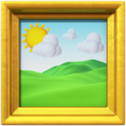

<div align="center">



# emoji2png

Rasterize an emoji into a transparent PNG.

[![build][build-image]][build-url]

[build-image]: https://github.com/ungoldman/emoji2png/actions/workflows/tests.yml/badge.svg
[build-url]: https://github.com/ungoldman/emoji2png/actions/workflows/tests.yml

</div>

## Install

```
make install
```

Builds a universal release binary and copies it to `/usr/local/bin`. Override
the location with `PREFIX`, e.g. `make install PREFIX=$HOME/.local`.

## Usage

macOS only. Renders the system emoji font via CoreText.

```
emoji2png <emoji|alias> [output.png] [--size N]
```

```
emoji2png rocket              # -> rocket.png, 160x160
emoji2png :rocket:            # colons optional
emoji2png 🚀                  # -> emoji.png
emoji2png rock logo.png       # explicit output path
emoji2png 🪨 logo.png --size 256
```

- Input is an emoji literal or a [gemoji](https://github.com/github/gemoji)
  shortcode, with or without surrounding colons.
- Output path defaults to `<alias>.png` for an alias, otherwise `emoji.png`.
- `--size` is the square edge in pixels (default 160).

## Sizing and fidelity

Apple Color Emoji is a bitmap font (`sbix`): each glyph is a set of pre-rendered
PNGs at fixed sizes ("strikes"), not a scalable vector. The strikes are 20, 26,
32, 40, 48, 52, 64, 96, and 160 pixels, so **160 is the sharpest size**. Smaller
sizes downsample cleanly. Larger sizes are smooth but soft upscales of the 160px
strike. They're fine when you need the dimensions, never sharper than 160.

## Development

```
swift build                        # compile
swift test                         # run the tests
swift test --enable-code-coverage  # run the tests with coverage
```

`make` wraps the common targets: `make build`, `make test`, `make install`, `make uninstall`.

Local development requires full Xcode, not just the Command Line Tools, or the test suite won't run.

## Contributing

Contributions are welcome. See [CONTRIBUTING.md](CONTRIBUTING.md) for guidelines.

## License

[ISC](LICENSE). Alias data derived from [gemoji](https://github.com/github/gemoji)
(MIT).

The logo is the framed-picture emoji, rendered by emoji2png itself.
